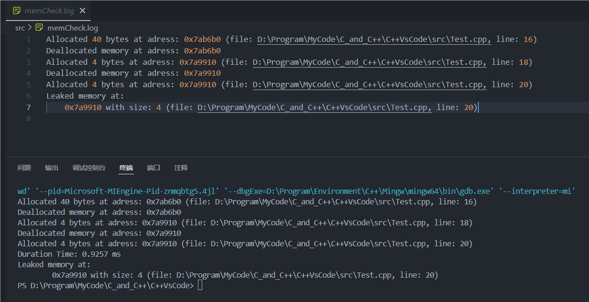

# C++相关

## lyf_wheels(自制/模仿的小轮子)

### 1. MemorCheck库

内存检测库, 可检测自己使用new分配的内存信息, 可自动检测是否有内存泄漏并给出泄漏信息

使用方法: 在头文件的最后导入MemCheck.h, 并在你的编译环境中链接上MemCheck.cpp即可, 下面是一个简单的模板

```c++
#include <iostream>
#include "lyf_wheels/MemoryCheck/MemCheck.h"	// 必须放在头文件的最后!!!

int main() {
    // 可以设置log的流向(Just_File, Just_Cout, File_And_Cout), 类型是memCheck::LogType的枚举量, 第二个参数为文件地址
    SET_LOG_TYPE(memCheck::LogType::File_And_Cout, "memCheck.log");
    // 是否启动分配信息追踪, 若启用会将我们每次new和delete的信息写入log对应的流中
    TRACE_OFF();
    // 是否启用内存检测(开启后才会检测内存泄漏)
    MEM_ON();
    /*
    	你的代码
    */
    MEM_OFF();
    return 0;
}
```

对于下面一个简单的案例:

```c++
#include <iostream>
#include "lyf_wheels/MemoryCheck/MemCheck.h"	// 必须放在头文件的最后!!!

int main() {
    SET_LOG_TYPE(memCheck::LogType::File_And_Cout, "memCheck.log");
    TRACE_OFF();
    MEM_ON();
    
    int *a = new int[10];
    delete[] a;
    a = new int(5);
    delete a;
    a = new int(99);	// 我们后续没有再delete了, 那么此时应该会出现内存泄露
    
    MEM_OFF();
    return 0;
}
```

我的电脑上测试结果如下: 

